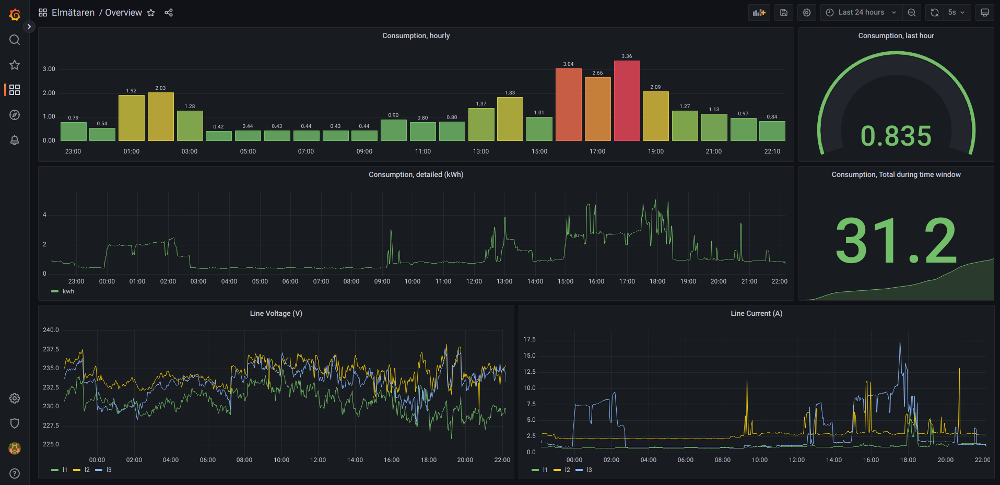

# p1-influxdb

A simple Python script and a Grafana dashboard to monitor your smartmeter by the P1 port.

[](grafana-overview.png)

# Details
* Python 3
* Uses [nrocco/smeterd](https://github.com/nrocco/smeterd) to access the meter.
* Uses InfluxDB 2.x and Flux query language.
* Grafana dashboard

Confirmed working on a Raspberry Pi, reading a Vattenfall S34U18 meter using a UC232A USB to serial adapter.  
But it should work on any system with Python support and an USB port.

# Installation
The recommended approach is to use a Python virtual environment and launch the application with systemd (or in a Docker container).
```bash
# 1. Install Dependencies (From a plain Raspian install)
apt install python3-venv git

# 2. Clone code
git clone https://github.com/sandnabba/p1-influxdb.git /opt/p1-influxdb

# 3. Deploy Python virtual environment and install dependencies
cd /opt/p1-influxdb
python3 -m venv .
./bin/pip install -r requirements.txt

# 4. Install systemd unit file
cp p1-influxdb.service /etc/systemd/system/
systemctl enable p1-influxdb

# 5. Create configuration:
cp env_example .env

# 6. Edit configuration and start application
# systemctl start p1-influxdb
```

# Contribution
Please open an issue or a pull request with questions and/or suggestions.